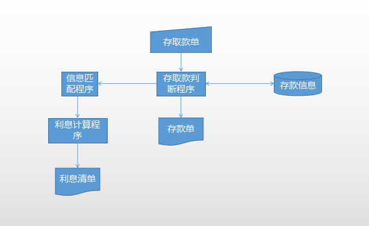
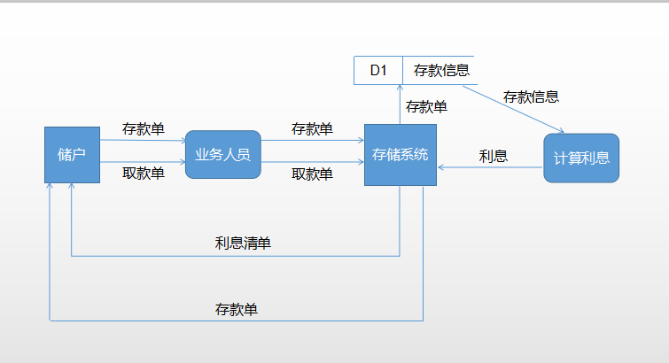

# 需求分析
## 1. 问题定义
>1. 工程项目名称：**银行计算机存储系统**
>
>
>2. 使用方：**广大储户**
>
>
>3. 开发方：**系统架构师**
>
>
>4. 对问题的概括定义：为实现广大储户的对银行卡的  <b>`安全 、有效 、便捷`</b>的操作
>，我们的开发者设计了顺应需求的系统，希望能够实现储户们存款一步到位，存款信息由业务人员
>输入系统，既增加了操作的安全性与可靠性，也大大减轻了储户的负担。取款只需经过业务人员
>确认方可得到利息清单。
## 2. 可行性分析
* *技术可行性分析：*由储户将存款单、取款单交由业务人员来把信息录入系统，首先增强了系统
的数据的规范性和后期的可维护性，其次这是这类技术已经非常成熟，没有涉及到高难点，所以
用现有的技术是一定能实现这个系统的。

* *操作可行性分析：*随着人们生活节奏的加快，他们更期望以微小的操作来达到和以前付出更多
同样的效果，用户用几乎可以忽略的难度指数操作，对于他们（不是专业技术人员）来说这也很好
实现，所以本系统的操作方式在这个用户组织内行得通。

* *经济可行性分析：*实现这个系统需要的成本微乎其微，相比于储户花钱去体验这种服务，经济效益明显高得多。

## 3. 系统流程图

## 4. 数据流图

